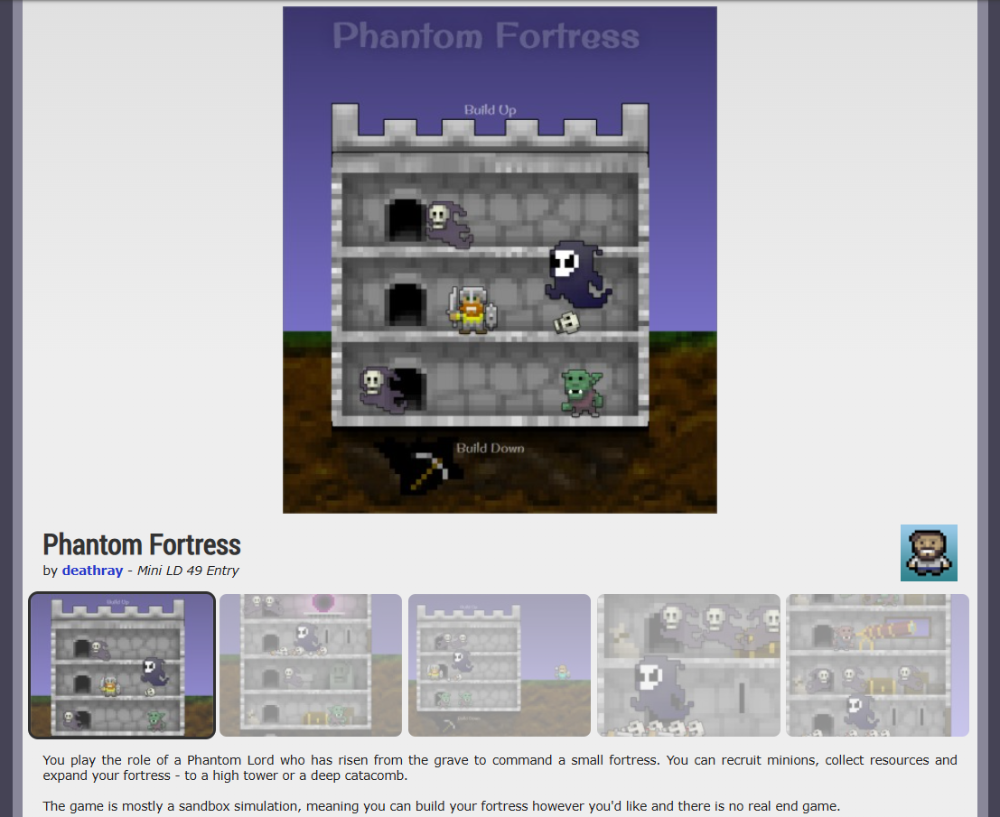

# Phantom Fortress

## Play

Play latest dev version: https://morph-games.github.io/phantom-fortress/

### Tips

- The Phantom Lord is immortal and will be reborn if he dies
- Rooms produce gold/souls/arcane or harvest stone/ore/gold when they have goons working in them
- When you build up or down, you begin with a room that produces nothing; try remodeling for a better room type
- Tap on corpses and skulls to harvest souls and loot gold
- Always keep your floors filled with goons working
- A mine with no natural resources left will harvest stone
- Arcane knowledge increases the health and power of the Phantom Lord

## History
 
Originally made in 48 hours for the Ludum Dare Mini-LD #49 competition in 2014.

Original Mini-LD entry page: https://web.archive.org/web/20141212152809/http://ludumdare.com/compo/minild-49/?action=preview&uid=17861

> You play the role of a Phantom Lord who has risen from the grave to command a small fortress. You can recruit minions, collect resources and expand your fortress - to a high tower or a deep catacomb. The game is mostly a sandbox simulation, meaning you can build your fortress however you'd like and there is no real end game.

